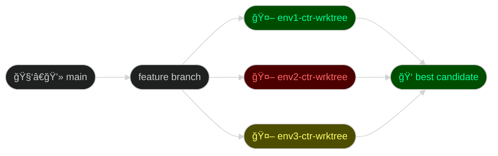
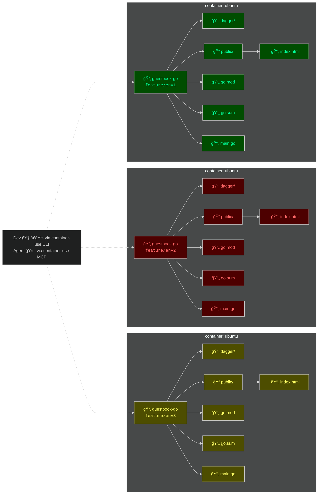

```mermaid
%%{ init {
  "theme": "dark",
  "themeVariables": {
    "primaryColor": "#21262d",
    "edgeLabelBackground":"#1e1e1e",
    "fontSize": "14px"
  }
} }%%
graph LR
    %% Main branch
    main([🧑â€ğŸ’» main])

    %% Feature branch
    feature([feature branch])

    %% Fan out to parallel agents
    rev1([🤖 env1-ctr-wrktree])
    rev2([🤖 env2-ctr-wrktree])
    rev3([🤖 env3-ctr-wrktree])

    %% Final merge
    best([👠best candidate])

    %% Flow connections
    main --> feature 
    feature --> rev1
    feature --> rev2
    feature --> rev3

    rev1 --> best
    rev2 --> best
    rev3 --> best

    %% Coloring per branch
    classDef greenBranch fill:#004d00,color:#00ff99;
    classDef redBranch fill:#4d0000,color:#ff6666;
    classDef yellowBranch fill:#4d4d00,color:#ffff66;

    class rev1 greenBranch;
    class best greenBranch;
    class rev2 redBranch;
    class rev3 yellowBranch;
```

```mermaid
%%{ init {
  "theme": "dark",
  "themeVariables": {
    "primaryColor": "#21262d",
    "edgeLabelBackground":"#1e1e1e",
    "fontSize": "14px"
  }
} }%%

graph LR

agent["Dev 🧑â€ğŸ’» via container-use CLI<br/>Agent 🤖 via container-use MCP"]

%% Container 3
    subgraph Container 3 [container: ubuntu]
      rev3["📂 guestbook-go<br/><code>feature/env3</code>"]
      rev3a["📠.dagger/"]
      rev3b["📠public/"]
      rev3bb["&nbsp;&nbsp;📄 index.html"]
      rev3c["📄 go.mod"]
      rev3d["📄 go.sum"]
      rev3e["📄 main.go"]

      rev3 --> rev3a
      rev3 --> rev3b
      rev3b --> rev3bb
      rev3 --> rev3c
      rev3 --> rev3d
      rev3 --> rev3e
    end
    
    %% Container 2
    subgraph Container 2 [container: ubuntu]
      rev2["📂 guestbook-go<br/><code>feature/env2</code>"]
      rev2a["📠.dagger/"]
      rev2b["📠public/"]
      rev2bb["&nbsp;&nbsp;📄 index.html"]
      rev2c["📄 go.mod"]
      rev2d["📄 go.sum"]
      rev2e["📄 main.go"]

      rev2 --> rev2a
      rev2 --> rev2b
      rev2b --> rev2bb
      rev2 --> rev2c
      rev2 --> rev2d
      rev2 --> rev2e
    end

%% Container 1
    subgraph Container 1 [container: ubuntu]
      rev1["📂 guestbook-go<br/><code>feature/env1</code>"]
      rev1a["📠.dagger/"]
      rev1b["📠public/"]
      rev1bb["&nbsp;&nbsp;📄 index.html"]
      rev1c["📄 go.mod"]
      rev1d["📄 go.sum"]
      rev1e["📄 main.go"]

      rev1 --> rev1a
      rev1 --> rev1b
      rev1b --> rev1bb
      rev1 --> rev1c
      rev1 --> rev1d
      rev1 --> rev1e
    end

    agent -...-> rev1
    agent -...-> rev2
    agent -...-> rev3

    %% Coloring
    classDef green fill:#004d00,color:#00ff99;
    classDef red fill:#4d0000,color:#ff6666;
    classDef yellow fill:#4d4d00,color:#ffff66;

    class rev1,rev1a,rev1b,rev1bb,rev1c,rev1d,rev1e green;
    class rev2,rev2a,rev2b,rev2bb,rev2c,rev2d,rev2e red;
    class rev3,rev3a,rev3b,rev3bb,rev3c,rev3d,rev3e yellow;
```
